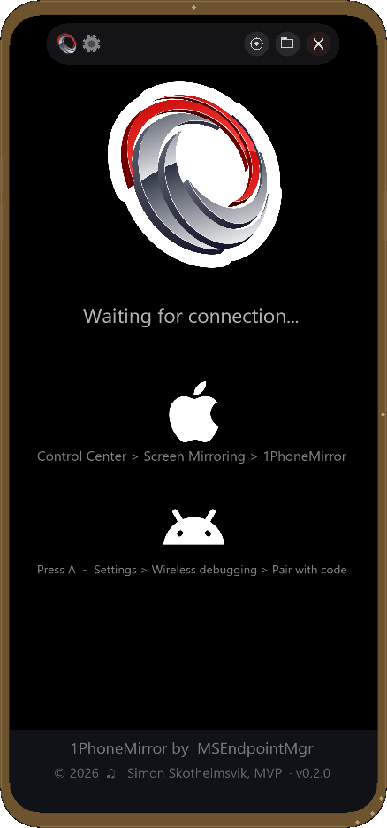

# 1PhoneMirror

Wireless screen mirroring for **iOS** (AirPlay) and **Android** (scrcpy) on Windows — in a single native app.



---

## Features

- **AirPlay receiver** — mirror any iPhone or iPad without iTunes, cables, or third-party drivers
- **Android mirroring** — built on the proven [scrcpy](https://github.com/Genymobile/scrcpy) protocol
- **Realistic phone frame** — your device on screen looks like the real thing, with a configurable bezel colour
- **Screenshots** — one-key capture of the screen, the phone frame, or the framed phone
- **Lightweight** — single MSI, no background services, no telemetry
- **Free and open** — released under GPL-3.0

---

## Install

The easiest way is via [winget](https://learn.microsoft.com/windows/package-manager/winget/):

```powershell
winget install MSEndpointMgr.1PhoneMirror
```

Or grab the latest MSI directly from the [Releases page](https://github.com/MSEndpointMgr/1PhoneMirror/releases/latest).

---

## Quick start

1. Launch **1PhoneMirror** from the Start menu.
2. Make sure your phone and your PC are on the **same Wi-Fi network**.
3. **iPhone / iPad:** open Control Center → **Screen Mirroring** → pick `1PhoneMirror`.
4. **Android:** plug the device in via USB once (to enable ADB), then connect from the Sources panel.

---

## Keyboard shortcuts

| Key | Action |
|---|---|
| `S` | Toggle Settings panel |
| `I` | Toggle Info panel |
| `V` | Toggle Version history |
| `P` | Toggle Phone frame |
| `Ctrl + S` | Screenshot |
| `Ctrl + C` | Copy screenshot to clipboard |
| `Ctrl + X` | Cut screenshot to clipboard |
| `Esc` | Quit |

---

## Requirements

- Windows 10 (build 19041) or Windows 11, x64
- A Wi-Fi network shared with the phone for AirPlay
- USB cable for the initial Android pairing

---

## Privacy

1PhoneMirror runs **entirely on your PC**. No accounts, no cloud, no telemetry. Mirroring traffic stays on your local network.

---

## License

[GPL-3.0](LICENSE)

---

## Acknowledgements

- [scrcpy](https://github.com/Genymobile/scrcpy) by Genymobile — the Android mirroring protocol
- The Bonjour / mDNS community — AirPlay discovery
- Built and maintained by [Simon Skotheimsvik](https://msendpointmgr.com/author/simon-skotheimsvik/)
